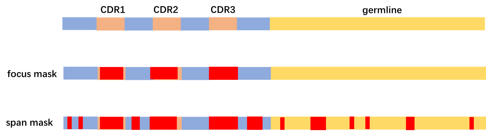
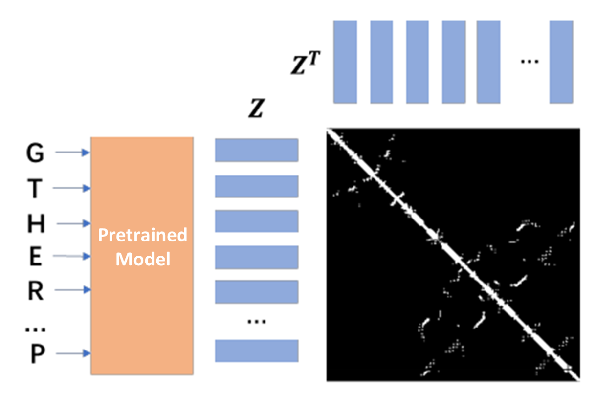
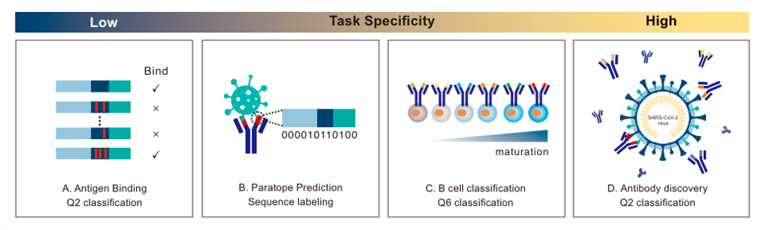
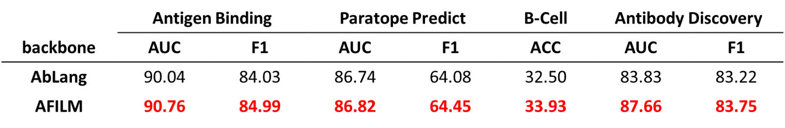
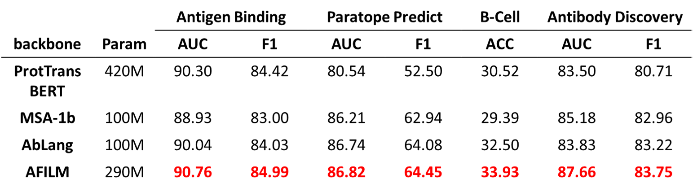
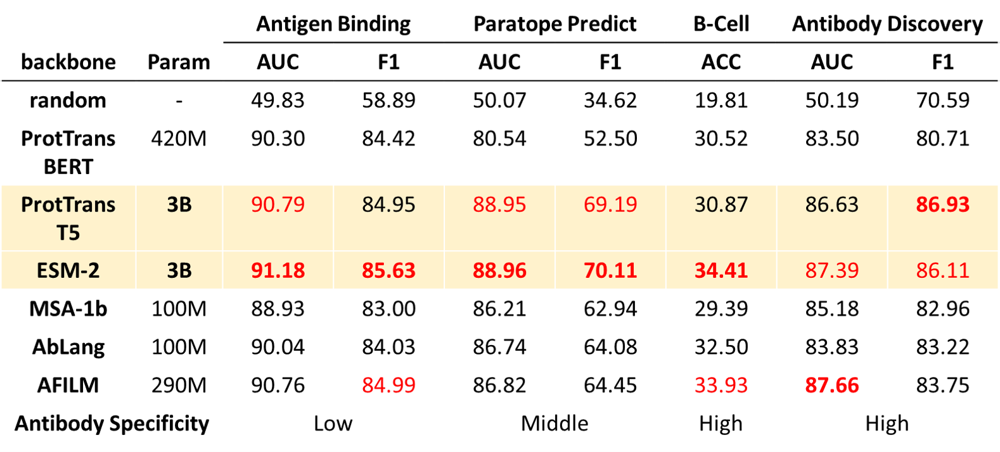
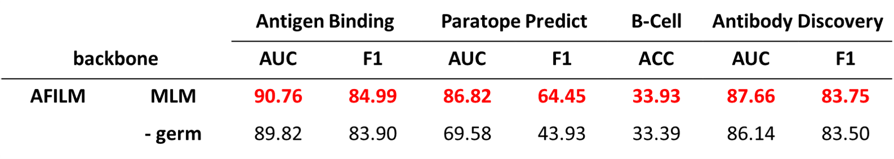
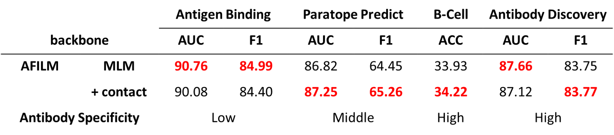

# AFILM: Antibody Feature Intensified Language Model

The code repo for *AFILM: Antibody Feature Intensified Language Model*.

## Introduction

AFILM is a pretrained antibody language model. It is pretrained by *Masked Language Modeling with Evolution-aware Focused Span Mask* task with antibody sequence data, and finetuned by *contact map prediction* task with antibody structure data. AFILM can achieve the best performance among other pretrained antibody and protein language models with the same parameter scale, and performs better in tasks with high antibody specificity.

## Dataset

### Download

We used two dataset during training. For pretraining, we used [Observed Antibody Space database](http://opig.stats.ox.ac.uk/webapps/oas/), including over 2 billion antibody sequences. 

To download the OAS database, go to the sequences search page and search without choosing any attributes, and a shell-script with the commands to download all the data-units will be generated. Run the following command to download

```bash
./bulk_download.sh
```

For finetuning, we used [IgFold](https://github.com/Graylab/IgFold), including the predicted structures of 104K non-redundant paired antibody sequences from the Observed Antibody Space database. The dataset can be downloaded by

```bash
wget https://data.graylab.jhu.edu/OAS_paired.tar.gz
```

### Preprocess

- OAS

We use [mmseqs](https://github.com/cradlebio/mmseqs) to remove duplicate sequences. Please configure mmseqs before doing deduplicate.

```bash
# deduplicate
mmseqs easy-linclust unpaired_heavy.fasta clusterRes _tmp_files/tmp >> _tmp_files/tmp/output_linclust.txt 2>&1
```

Noted that we need CDR sequences and germline sequences for pretraining, so we use the `rep` column of `clusterRes_cluster.tsv` to filter out the removed items. Use heavy chain sequences as an example.

```python
df=pd.read_csv('clusterRes_cluster.tsv', seq='\t', header=None, names=['rep','seq'])
rep_id=np.unique(df['rep'].values)
del df

# original csv
df=pd.read_csv('unpaired_heavy.csv'.format(i))
seq_=df['sequence'][rep_id].values
germ_=df['germline'][rep_id].values
cdr1_=df['cdr1'][rep_id].values
cdr2_=df['cdr2'][rep_id].values
cdr3_=df['cdr3'][rep_id].values
del df

# filtered csv
df=pd.DataFrame()
df['sequence']=seq_
df['germline']=germ_
df['cdr1']=cdr1_
df['cdr2']=cdr2_
df['cdr3']=cdr3_
df.to_csv('processed_data/uh.csv',index=False)
```

For more details, please turn to `pretrain/mlm/utils/create_dedup_file.py`.

- IgFold

We use [IgBLASTp](https://ncbi.github.io/igblast/) to search for germlines of antibody. Please configure it first.

The output format of `IgBLASTp` is as follows. We use three databases to do germline search: *human*, *mouse* and *rat*, which covered most of the antibodies in OAS paired dataset. The germline with the highest percent identity is chosen as searching result.

```
Database: mouse_V.fasta
           512 sequences; 50,181 total letters

Query= 
Length=117
                                                                                                      Score     E
Sequences producing significant alignments:                                                          (Bits)  Value

VH7183.a19.31 unnamed protein product                                                                 155     4e-53
7183.20.37 unnamed protein product                                                                    155     6e-53
VH7183.9 unnamed protein product                                                                      153     3e-52

Domain classification requested: imgt

Alignment summary between query and top germline V gene hit (from, to, length, matches, mismatches, gaps, percent identity)
FR1-IMGT	1	25	25	23	2	0	92
CDR1-IMGT	26	33	8	5	3	0	62.5
FR2-IMGT	34	50	17	12	5	0	70.6
CDR2-IMGT	51	58	8	3	5	0	37.5
FR3-IMGT	59	96	38	30	8	0	78.9
CDR3-IMGT (germline)	97	98	2	2	0	0	100
Total	N/A	N/A	98	75	23	0	76.5

Alignments

                                     <-------FR1-IMGT--------><CDR1-I><---FR2-IMGT----><CDR2-I><--------------FR3-IMGT---------
                  Query_1        1   EVQLVESGGGLVQPGGSLRLSCAASGFNISSYSMHWVRQAPGKGLEWVASIYPYSGYTYYADSVKGRFTISADTSKNTAYLQMNSLRAED  90
V  76.5% (75/98)  VH7183.a19.31  1   EVQLVESGGGLVKPGGSLKLSCAASGFTFSSYAMSWVRQTPEKRLEWVATISSGGSYTYYPDSVKGRFTISRDNAKNTLYLQMSSLRSED  90
V  76.5% (75/98)  7183.20.37     1   EVQLVESGGGLVKPGGSLKLSCAASGFTFSDYGMHWVRQAPEKGLEWVAYISSGSSTIYYADTVKGRFTISRDNAKNTLFLQMTSLRSED  90
V  75.5% (74/98)  VH7183.9       1   EVMLVESGGGLVKPGGSLKLSCAASGFTFSSYAMSWVRQTPEKRLEWVATISSGGSYTYYPDSVKGRFTISRDNAKNTLYLQMSSLRSED  90

                                     ----->  
                  Query_1        91  TAVYYCAR  98
V  76.5% (75/98)  VH7183.a19.31  91  TAMYYCAR  98
V  76.5% (75/98)  7183.20.37     91  TAMYYCAR  98
V  75.5% (74/98)  VH7183.9       91  TAMYYCAR  98


Lambda      K        H        a         alpha
   0.316    0.131    0.402    0.792     4.96 

Gapped
Lambda      K        H        a         alpha    sigma
   0.267   0.0410    0.140     1.90     42.6     43.6 

Effective search space used: 1706324

  Database: mouse_V.fasta
    Posted date:  Aug 24, 2022  3:03 PM
  Number of letters in database: 50,181
  Number of sequences in database:  512

Matrix: BLOSUM62
Gap Penalties: Existence: 11, Extension: 1
Neighboring words threshold: 11
Window for multiple hits: 40
```

We use the following commands to do data processing.

```bash
# After downloading IgFold dataset, run following command to generate processed pickle file, 
# which includes heavy sequence, light sequence and coordinates
python get_data.py

# After configuring IgBLASTp, use it to search for germline sequences of antibodies, 
# and run the following command to add the search result to the processed pickle file.
python get_germline.py

# (optional) You can run the following command to check if data processing is OK.
python _check_data.py
```

The structure of processed pickle file is

```python
{
    file: '<file name>',
    hseq: '<heavy sequence>',
    hgerm: '<heavy germline>',
    hdata:[['<res>', x, y, z],
           ['<res>', x, y, z],
            ...],
    
    lseq: '<light sequence>',
    lgerm: '<light germline>',
    ldata:[['<res>', x, y, z],
           ['<res>', x, y, z],
            ...]
}
```

(Optional) To accelerate model training, you can transform training data into mindrecord format using the following scripts.

```bash
# MLM train data process
python create_md_split_mlm.py
# contact map train data process
python create_md_split_cont.py
```

## Model Architecture

The architecture of AFILM is BERT-Large.

```yaml
large_batch_size: 256
large_net_cfg:
    seq_length: 512
    vocab_size: 30
    hidden_size: 1024
    num_hidden_layers: 24
    num_attention_heads: 16
    intermediate_size: 4096
    hidden_act: "gelu"
    hidden_dropout_prob: 0.0
    attention_probs_dropout_prob: 0.0
    max_position_embeddings: 40000
    type_vocab_size: 2
    initializer_range: 0.02
    use_relative_positions: False
    dtype: float32
    compute_type: float16
```

The vocabulary is as follows.

```python
map_dict = {'[PAD]': 0, '[UNK]': 1, '[CLS]': 2, '[SEP]': 3, '[MASK]': 4, 
			'L': 5, 'A': 6, 'G': 7, 'V': 8, 'E': 9, 'S': 10, 'I': 11, 'K': 12, 
			'R': 13, 'D': 14, 'T': 15, 'P': 16, 'N': 17, 'Q': 18,
             'F': 19, 'Y': 20, 'M': 21, 'H': 22, 'C': 23, 'W': 24, 'X': 25}

kind_dict = {'[H]':26, '[L]':27, '[P]':28}
```


## Pretrain

We use *Masked Language Modeling with Evolution-aware Focused Span Mask* as pretraining task.

Considering the evolutional information contained in germline sequence of each antibody, we combine the antibody sequences and the corresponding germline sequences together as the input to the model. When generating masks, we use continuous mask to the CDRs of antibody first, as the learning difficulty of these regions are the highest. Then we use span mask to the remaining part of input sequence.



The input sequences are designed as follows.

```
Heavy:
[CLS] [H] ASEQ [SEP] GSEQ [SEP] [PAD]

Light:
[CLS] [L] ASEQ [SEP] GSEQ [SEP] [PAD]

Paired:
[CLS] [P] ASEQ_H [SEP] ASEQ_L [SEP] GSEQ_H [SEP] GSEQ_L [SEP] [PAD]
```

## Finetune

We use antibody structure data to do model finetuning. The task is contact map prediction. Use pretrained model to extract features of input sequences, and use bilinear projection to predict the contact within heavy sequence and light sequence.



$$
[Z^H;Z^L]=\text{model}(input),\\

pred^H=\text{sigmoid}(Z^HW(Z^H)^T+b),\\

pred^L=\text{sigmoid}(Z^LW(Z^L)^T+b),\\

Loss=\text{BCE}(contact^H,pred^H)+\text{BCE}(contact^L,pred^L).

$$


## Experiments

We use ATUE as benchmark from [On Pre-trained Language Models for Antibody](https://arxiv.org/abs/2301.12112v2).



We use existing protein or antibody pretrained models with various parameter scales as baselines to compare with AFILM, including ProtTrans, ESM and AbLang.

AFILM is better than existing antibody pretrained model AbLang.



AFILM achieves the best performance among models with the same parameter scales.



AFILM achieves better performance on tasks with high antibody specificity. Large models achieves relatively better performance.




## Ablation

We set up two ablation studies. The first one is not combining germline sequence with antibody sequence when extracting features. The second one is not finetuning with structure data.

Without germline sequences as input, the performance dropped on all of the tasks.



Without structure data finetuning, the performance on tasks with high antibody specificity dropped, showing that structure information is helpful to high antibody specificity tasks.




## Code

Code repo structure

```shell
.
└─pretrain
  ├─mlm
    ├─src
      ├─model_utils
        ├─config.py # pretrain config
        ├─moxing_adapter.py # adapter for training on modelarts
        ├─device_adapter.py # adapter for distribute training
        ├─local_adapter.py # adapter for local training
      ├─__init__.py
      ├─dataset.py # dataloader
      ├─bert_model.py # bert model architecture
      ├─bert_for_pre_training.py # bert pretraining architecture
      ├─adam.py
      ├─CRF.py
      ├─utils.py
    ├─utils
      ├─create_dedup_file.py # remove duplicate sequence and generate training csv
      ├─create_md_split_mlm.py # transform training data into mindrecord format
      ├─file_split.py # split files for faster process
      ├─get_cdr3_sequences.py
    ├─extract_embedding_downstream_new.py # use pretrained model to extract features without germline sequence
    ├─extract_embedding_downstream_newg.py # use pretrained model to extract features with germline sequence
    ├─pretrain_config.yaml # pretrain config
    ├─run_pretrain.py # pretrain main
  ├─txt_train
    ├─src
      ├─model_utils
        ├─config.py # pretrain config
        ├─moxing_adapter.py # adapter for training on modelarts
        ├─device_adapter.py # adapter for distribute training
        ├─local_adapter.py # adapter for local training
      ├─__init__.py
      ├─dataset.py # dataloader
      ├─bert_model.py # bert model architecture
      ├─bert_for_pre_training.py # bert pretraining architecture
      ├─adam.py
      ├─CRF.py
      ├─utils.py
    ├─pretrain_config.yaml # pretrain config
    ├─run_pretrain.py # pretrain main
  ├─contact
    ├─cont
      ├─src
        ├─model_utils
          ├─config.py # pretrain config
          ├─moxing_adapter.py # adapter for training on modelarts
          ├─device_adapter.py # adapter for distribute training
          ├─local_adapter.py # adapter for local training
        ├─__init__.py
        ├─dataset.py # dataloader
        ├─bert_model.py # bert model architecture
        ├─bert_for_pre_training.py # bert pretraining architecture
        ├─adam.py
        ├─CRF.py
        ├─utils.py
      ├─pretrain_config.yaml # pretrain config
      ├─run_pretrain.py # pretrain main
    ├─data_process
      ├─md
        ├─create_md_split_cont.py # transform training data into mindrecord format
        ├─check_md_cont.py
      ├─get_data.py # transform raw data into pickle format
      ├─get_germline.py # add germline sequence into pickle format
      ├─_check_data.py
      ├─_get_cdr3_sequences.py
└─downstream
  ├─bind
    ├─new # antibody sequence without germline
    ├─newg # antibody sequence with germline
    ├─newgcont # antibody sequence with germline and finetune
    ├─ablang
    ├─bert
    ├─t5
    ├─esm1bmsa
    ├─esm1v
    ├─esm2
    ├─random # random input
  ├─paratope
    ├─new # antibody sequence without germline
    ├─newg # antibody sequence with germline
    ├─newgcont # antibody sequence with germline and finetune
    ├─ablang
    ├─bert
    ├─t5
    ├─esm1bmsa
    ├─esm1v
    ├─esm2
    ├─random # random input
  ├─bcell
    ├─new # antibody sequence without germline
    ├─newg # antibody sequence with germline
    ├─newgcont # antibody sequence with germline and finetune
    ├─ablang
    ├─bert
    ├─t5
    ├─esm1bmsa
    ├─esm1v
    ├─esm2
    ├─random # random input
  ├─discover
    ├─new # antibody sequence without germline
    ├─newg # antibody sequence with germline
    ├─newgcont # antibody sequence with germline and finetune
    ├─ablang
    ├─bert
    ├─t5
    ├─esm1bmsa
    ├─esm1v
    ├─esm2
    ├─random # random input
```

We recommend to run pretraining and finetuning on *ModelArts* for efficiency and convenience.

### Training and finetuning

Parameters in `pretrain/mlm/pretrain_config.yaml` are summarized as follows.

```python
# For model and training
bert_network # base, large
batch_size
loss_scale_value
scale_factor
scale_window
optimizer # AdamW, Lamb, Momentum
seq_length
vocab_size
hidden_size
num_hidden_layers
num_attention_heads
intermediate_size
hidden_act
hidden_dropout_prob
attention_probs_dropout_prob
max_position_embeddings
type_vocab_size
initializer_range
use_relative_positions

# For optimizer
AdamWeightDecay:
    decay_steps
    learning_rate
    end_learning_rate
    power
    warmup_steps
    weight_decay
    eps
Lamb:
    decay_steps
    learning_rate
    end_learning_rate
    power
    warmup_steps
    weight_decay
Momentum:
    learning_rate
    momentum
```

After setting up parameters, run scripts on ModelArts as follows. If you want to train on GPU, please turn to [QuickStart](https://gitee.com/mindspore/models/blob/master/official/nlp/Bert/README.md#quick-start).

```text
# (1) Upload the code folder to S3 bucket.
# (2) Click to "create training task" on the website UI interface.
# (3) Set the code directory to "/{path}/bert" on the website UI interface.
# (4) Set the startup file to /{path}/bert/train.py" on the website UI interface.
# (5) Perform a or b.
#     a. setting parameters in /{path}/bert/pretrain_config.yaml.
#         1. Set ”enable_modelarts=True“
#         2. Set other parameters, other parameter configuration can refer to `./scripts/run_distributed_pretrain_ascend.sh`
#     b. adding on the website UI interface.
#         1. Add ”enable_modelarts=True“
#         3. Add other parameters, other parameter configuration can refer to `./scripts/run_distributed_pretrain_ascend.sh`
# (6) Upload the dataset to S3 bucket.
# (7) Check the "data storage location" on the website UI interface and set the "Dataset path" path (there is only data or zip package under this path).
# (8) Set the "Output file path" and "Job log path" to your path on the website UI interface.
# (9) Under the item "resource pool selection", select the specification of 8 cards.
# (10) Create your job.
# After training, the '*.ckpt' file will be saved under the'training output file path'
```

### Inference

Run following script after adjusting the path of pretrained checkpoints and sequences to be extracted.

```bash
# extracting feature without germline as input
python pretrain/mlm/extract_embedding_downstream_new.py

# extracting feature with germline as input
python pretrain/mlm/extract_embedding_downstream_newg.py
```

